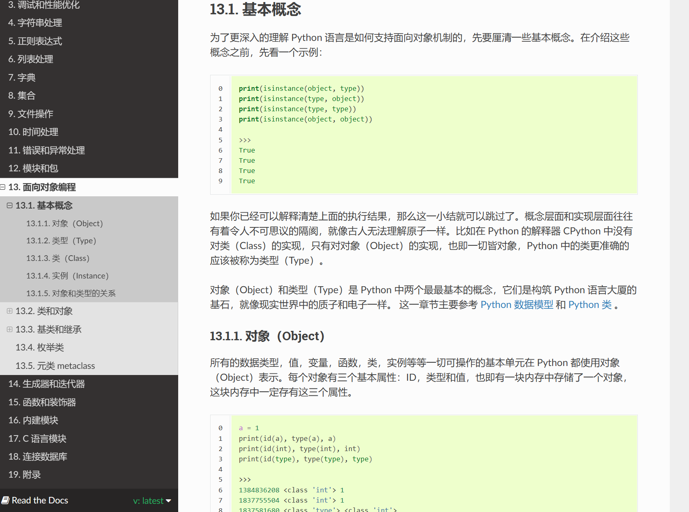

## Python面向对象编程学习笔记

### 1.让chatgpt4生成一份学习大纲

学习Python面向对象编程的大纲可以根据Python官方文档以及面向对象编程的基本原则来编制。下面是一个大致的学习大纲，包括注明的重点：

1. **面向对象编程基础**
   - 理解对象和类的概念
   - 学习如何定义类
   - 创建对象实例
   - 理解方法和属性
   - 重点：掌握类的定义和对象的生成过程
2. **类的属性和方法**
   - 实例属性与类属性
   - 实例方法、类方法和静态方法
   - 属性的获取与设置
   - 属性装饰器`@property`的使用
   - 重点：理解不同类型方法和属性的用法及适用场景
3. **继承与多态**
   - 子类的创建和继承
   - 覆盖父类的方法
   - 多态的概念和实现
   - 使用`super()`函数
   - 重点：掌握继承机制和方法重写
4. **魔术方法**
   - `__init__`、`__str__`、`__repr__`等常用魔术方法
   - 运算符重载
   - 上下文管理器的`__enter__`和`__exit__`
   - 重点：理解Python特有的魔术方法及其应用
5. **封装与接口**
   - 私有属性和方法的使用
   - 抽象基类的定义
   - 接口与实现的分离
   - 重点：学会保护类的内部数据和实现细节
6. **异常处理**
   - 异常的概念
   - 创建和使用自定义异常
   - 异常链
   - `try`...`except`...`else`...`finally`结构
   - 重点：掌握如何通过异常处理提高程序的健壮性
7. **高级主题（选学）**
   - 元类的使用和理解
   - 类装饰器
   - 描述符的使用
   - 多重继承和方法解析顺序（MRO）
   - 重点：理解Python高级特性
8. **实战和项目**
   - 分析真实的面向对象编程案例
   - 设计和实现小项目
   - 代码重构练习
   - 性能分析和优化
   - 重点：实践和巩固面向对象编程的知识

在学习过程中，应当通过实际的编程练习和小项目来加深对面向对象概念的理解。此外，官方文档是学习的重要资源，建议学习者结合文档中的例子和解释来提高学习效率。

### 2.学习官方的材料，一般比较简洁，适合快速入门。

[13. 面向对象编程 — Python 从入门到深入 1.0 文档 (pythonhowto.readthedocs.io)](https://pythonhowto.readthedocs.io/zh-cn/latest/object.html#id14)

### 3、标准教材，一般比较大，用于参考。

Python3面向对象编程.第2版.pdf

### 4.视频培训材料

[ Object Oriented Programming with Python - Full Course for Beginners - YouTube](https://www.youtube.com/watch?v=Ej_02ICOIgs)

Object Oriented Programming is an important concept in software development. In this complete tutorial, you will learn all about OOP and how to implement it using Python. 

💻 Code: [https://github.com/jimdevops19/PythonOOP](https://www.youtube.com/redirect?event=video_description&redir_token=QUFFLUhqbWNySENBUHlvSjJUNnhLZWpkNkdBLU02VHB3d3xBQ3Jtc0tsWFE4eXhETEdIenJWUUVNWGFYc0hLb0RfSzdMTWxFMzZveXgzVktFZURockw1Z3g0VjhZTTBKYkFBYVBKbXZFVy02VGdSNXBDWmxJdExFdVdzLS1icjZvOVdjX1hWTGd1WXZnYmJqRlF6X3cweXRQTQ&q=https%3A%2F%2Fgithub.com%2Fjimdevops19%2FPythonOOP&v=Ej_02ICOIgs) 

🔗 Tutorial referenced for a deeper explanation about __repr__:  [  • Python Magic Methods | Differences be... ](https://www.youtube.com/watch?v=FIaPZXaePhw&t=0s) 

✏️ Course developed by Jim from JimShapedCoding. Check out his channel: [  / @jimshapedcoding ](https://www.youtube.com/channel/UCU8d7rcShA7MGuDyYH1aWGg) 

⭐️ Course Contents 

⭐️ ⌨️ ([0:00:00](https://www.youtube.com/watch?v=Ej_02ICOIgs&t=0s)) Getting Started with Classes

 ⌨️ ([0:12:11](https://www.youtube.com/watch?v=Ej_02ICOIgs&t=731s)) Constructor, *_init_* 

⌨️ ([0:50:35](https://www.youtube.com/watch?v=Ej_02ICOIgs&t=3035s)) Class vs Static Methods 

⌨️ ([1:13:22](https://www.youtube.com/watch?v=Ej_02ICOIgs&t=4402s)) Inheritance 

⌨️ ([1:30:14](https://www.youtube.com/watch?v=Ej_02ICOIgs&t=5414s)) Getters and Setters 

⌨️ ([1:51:00](https://www.youtube.com/watch?v=Ej_02ICOIgs&t=6660s)) OOP Principles

其他学习总结：[Python视频学习（二、Python面向对象）_视频教程 python 面向对象-CSDN博客](https://blog.csdn.net/qq_30162859/article/details/82962699)

### 5.让chatgpt4出题然后自己作答

输入：现在你作为一个出题老师，你出20题python 面向对象编程的单选题，我来回答，下面开始

